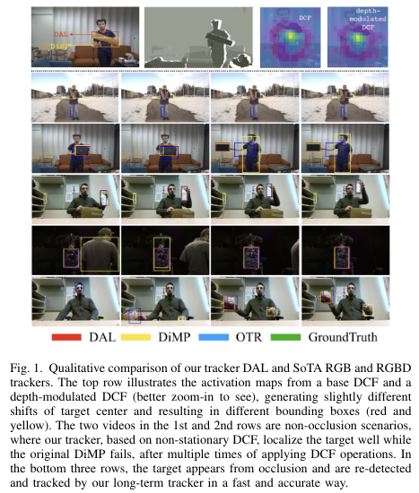
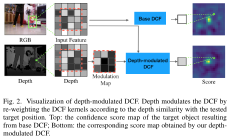

# DAL
DAL tracker code for the paper
  **"DAL: A Deep Depth-aware Long-term Tracker"** (ICPR2020)

The best RGBD trackers provide high accuracy but are slow to run. On the other hand, the best RGB trackers are fast but clearly inferior on the RGBD datasets. In this work, we propose a deep depth-aware long-term tracker that achieves state-of-the-art RGBD tracking performance and is fast to run. We reformulate deep discriminative correlation filter (DCF) to embed the depth information into deep features. Moreover, the same depth-aware correlation filter is used for target re-detection. Comprehensive evaluations show that the proposed tracker achieves state-of-the-art performance on the Princeton RGBD, STC, and the newly-released CDTB benchmarks and runs 20 fps.

<p align="center">
  
</p>

<p align="center">
  
</p>

# Setup and dependencies
```
We use the same settings as the [Pytracking](https://github.com/visionml/pytracking).
```
# Evaluation
- To download the Dimp50.pth from the website
- To set the path to the pretrained checkpoints and the dataset in the local.py , e.g. CDTB (vot2020-rgbd)
- Then run :
```
python run_tracker.py dimp_rgbd_blend dimp50_votd --dataset votd --sequence 'bottle_room_occ_1' --debug 3
```

# Train
- no needs to train on RGBD dataset
- we pretrain the dimp50 on RGB datasets, then inference on RGBD datasets

If you use this code, please cite our paper (the bibtex will be updated soon after ICPR2020):
```
@inproceedings{qian2019dal,
  author    = {Qian, Yanlin and Yan, Song and Luke{\v{z}}i{\v{c}}, Alan and Kristan, Matej and K{\"a}m{\"a}r{\"a}inen, Joni-Kristian and Matas, Jiri},
  title     = {DAL--A Deep Depth-aware Long-term Tracker},
  booktitle = {25th International Conference on Pattern Recognition, {ICPR} 2020, Milan, Italy, January 10-15, 2020},
  year      = {2020},
}
```
